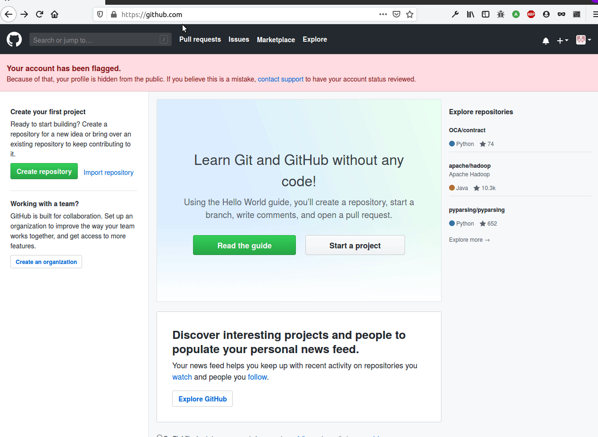
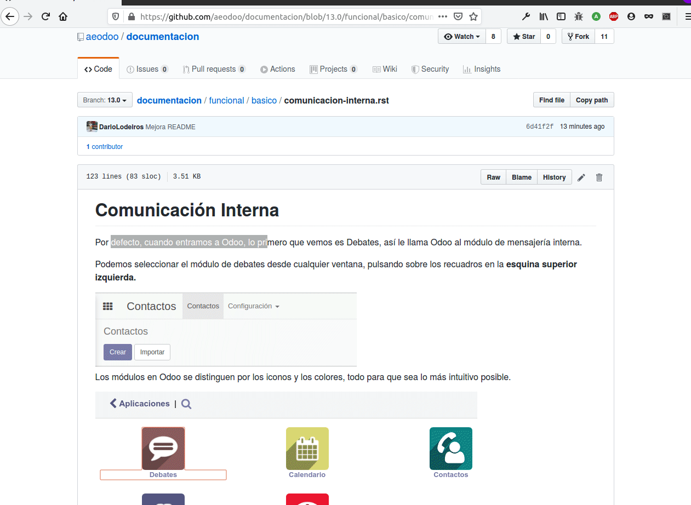

# Documentación Certificadora AEODOO

Proyecto de documentación en Español para la base de cursos y pruebas homologadas
por la Asociación Español de Odoo.

La presente base documental es una base referencial de conocimiento confiable,
no pretende ser un manual ni un tutorial por si mismo, si bien gracias a Sphinx puede ser
ensamblado y editado para utilizarse como fuente de múltiples tutoriales o cursos.

## Comenzando

Esta documentación es de libre uso y modificación, por lo que puede ser utilizada para la
orquestación de cursos, itinerarios, talleres, y todo tipo de acciones formativas. No se pretende
con ella hacer un manual al uso, si no documentar toda la información
necesaria para la búsqueda de referencias y contenidos estructurados.

### Índice

Puedes encontrar el índice completo de la documentación en el siguiente enlace:

* [Índice](https://github.com/aeodoo/documentacion/blob/13.0/index.rst) 

## Colaboración

Esta documentación esta supervisada por la Asociación Españolda de Odoo, pero
confeccionada por la comunidad. Puedes completar, mejorar y corregir la documentación
proponiendo nuevos cambios mediante Github, para ello, es necesario:

* [Una cuenta en Github](#creacion-de-cuenta-en-github)
* Modificar las fuentes:

	1- Desde el propio Github

	Es posible [modificar los contenidos desde la propia web de Github](#proceso-colaboracion-desde-tu-equipo), aunque
	para ello debemos limitarnos al editor que nos proporciona, por lo que está es una posible
	opción para pequeñas modificaciones que nos permite simplificar el proceso de colaboración.
	Desgraciadamente en el momento en el que las modificaciones sean de mayor calado con múltiples
	archivos, imágenes, etc... el proceso desde la interface se hace más complejo, por lo que se 
	recomienda modificar desde tu propio equipo.

	2- Desde tu equipo

	Descargar el repositorio completo en tu equipo te permitirá editar de un modo más ágil la documentación.
	Si bien inicialmente es necesario superar ciertas barreras de uso de Git, una vez hecho esto la edición
	será sencilla y ágil, por lo que te recomendamos encarecidamente que sigas atentamente la siguiente 
	[guía para la edición](#proceso-colaboracion-desde-tu-equipo).
			
### Documentación mediante ReStructureText

* [Plantilla](https://github.com/aeodoo/documentacion/blob/13.0/plantilla.rst) 

### Guía de Estilo AEODOO

La documentación se genera en Español teniéndo en cuenta la guía de estilo de traducción al Español (España):

* [Guía de estilo](https://www.aeodoo.org/traduccion-de-odoo-al-espanol-de-espana) 

### Estructura de la documentación

La documentación esta estructurada en un árbol de carpetas cuya raíz se divide en funcional, y técnico.
Cada subcarpeta dentro de estas mantiene una organización conceptúal agrupando aquellos conceptos que se entienden
dentro de una misma área. Cada concepto tiene su propio archivo .rst dentro de la carpeta donde le corresponda.

Las imágenes se cargan dentro de una carpeta "imagenes" situada en el mismo directorio del rst que las utiliza.

Dentro de un archivo rst dividimos en secciones los diferentes apartados del concepto desarrollado.

### Propuestas de cambios o añadidos

Cualquier modificación que realices quedará como un PullRequest en borrador a espera de ser validado por el
equipo mantenedor de la documentación. Si fuera necesaria cualquier modificación en tu propuesta se te hará constar en la
propia página del Pull Request, por lo que solo deberás seguir los siguientes paso para [modificar un Pull Request activo](#modificar-pull-request-activo).

## Autores

* **AEODOO** - *Mantenedor* - [AEODOO](https://www.aeodoo.org)

Puedes ver la lista completa de contribuyentes en [contribuyentes](https://github.com/aeodoo/documentacion/contributors) 

## Licencia

Este proyecto esta licenciado bajo [AGPL version 3](https://www.gnu.org/licenses/agpl-3.0.html)
Puedes usar, modificar y compartir este trabajo con la única condición de hacer mención expresa a la fuente original.

## Ayuda

### Creación de cuenta en Github

Si aún no tienes una cuenta en Github, deberás acceder a Github.com y seguir los siguientes pasos:

1.- Accede a Github.com y pulsa en el botón "Sign Up"

2.- Introduce tu nuevo nombre de usuario, mail y contraseña

3.- Sigue los pasos indicados por el asistente

4.- Welcome to Github :)

### Proceso colaboración desde GitHub

1.- Accede a la página de la documentación en el [repositorio](https://github.com/aeodoo/documentacion) que quieras editar:

2.- Utiliza el icono del lápiz para activar el modo edición y modifica el contenido a conveniencia, a continuación guarda y
directamente crea el Pull Request desde la propia página, primero te hará confirmar los cambios y después confirmar el Pull Request
contra el repositorio original de la documentación:

### Proceso colaboración desde tu equipo

#### Linux

#### Windows

### Modificar Pull Request activo

### Añadir nuevos archivos rst

### Añadir imágenes en rst

### Enlaces externos e internos en rst

