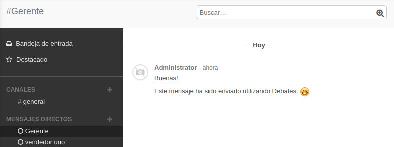
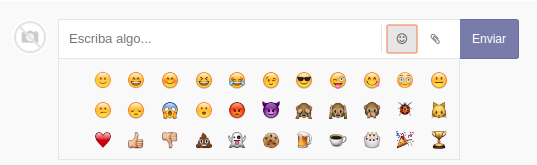
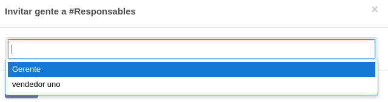
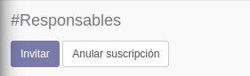
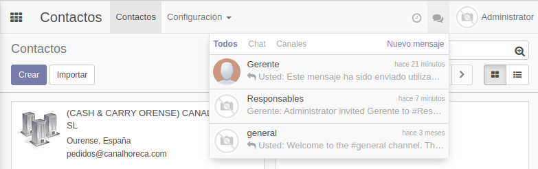
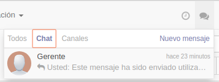
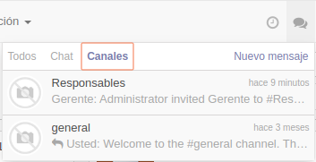

.. _comunicacion-interna:

#####################
Comunicación Interna
#####################

Por defecto, cuando entramos a Odoo, lo primero que vemos es Debates,
así le llama Odoo al módulo de mensajería interna.

Podemos seleccionar el módulo de debates desde cualquier ventana,
pulsando sobre los recuadros en la **esquina superior izquierda.**

.. figure:: imagenes/debates_1.png
   :alt: 

Los módulos en Odoo se distinguen por los iconos y los colores, todo
para que sea lo más intuitivo posible.

.. figure:: imagenes/debates_2.png
   :alt: 

En la ventana de Debates vemos que tenemos una pequeña notificación en
que nos pide permiso para a\ **cceder a nuestro ordenador** y habilitar
las **notificaciones de** **escritorio**. Si no estamos pendientes de de
los mensajes y estamos en otras páginas en nuestro navegador, Odoo
enviará una notificación en forma de Pop-up para que avisarnos que hemos
recibido un mensaje.

.. figure:: imagenes/debates_3.png
   :alt: 

Debates es similar a Whatsapp, podemos enviar mensajes directos a
nuestros compañeros o crear un grupo para hablar de un proyecto
concreto.

Canales
-----------

Los canales son como los grupos en Whatsapp, tenemos un canal por
defecto llamado **general,** todos los nuevos usuarios en el sistema
serán agregados automáticamente a este canal, esto es para que todos
puedan compartir información fácilmente.

Mensaje Directos
---------------------

Podemos enviar mensajes directamente al usuario que queramos, sólo
tenemos que **pulsar** sobre el **símbolo** de **"+"** y escribir el
**nombre del usuario.**

.. figure:: imagenes/canales_1.png
   :alt: 

Podemos tener todos los chats que queramos abiertos.

En la parte inferior del chat vemos que se pueden **subir archivos
adjuntos** y utilizar emoticonos.

Canales Privados
--------------------

Podemos crear un canal privado para determinadas personas, es
procedimiento es similar al anterior, **pulsamos sobre el símbolo "+"**
y escribimos el **nombre del nuevo canal**\ privado.

.. figure:: imagenes/canales_privados_1.png
   :alt: 

Cuando estamos en un canal, vemos que aparece un botón llamado
**Invitar**, ahora que tenemos nuestro canal creado sólo quedaría
invitar a las personas que lo compondrán.

.. figure:: imagenes/canales_privados_2.png
   :alt: 

Si pulsamos el botón nos saldrá la siguiente ventana en la cual podremos
**elegir** a los usuarios del sistema.

De esta manera ya tenemos creado nuestro **grupo privado** con dos
usuarios.

.. figure:: imagenes/canales_privados_4.png

Si hemos sido añadidos a un grupo, podemos abandonarlos pulsando sobre
el botón de **Anular suscripción** en cualquier momento.

Notificaciones
------------------

Odoo tiene siempre visible unos iconos para consultar las últimas
notificaciones recibidas, podemos consultarlo desde **cualquier modelo**
y **cualquier vista del sistema**.

Desde la vista de **Contactos**, pulsamos sobre el icono de bocadillos
de conversación en la **esquina superior derecha**

Podemos ver todas las notificaciones que tiene que ver con
conversaciones tanto personales, pulsando sobre la **pestaña Chat,**
como la de los grupos(Canales), pulsando en la **pestaña Canales**

|image0|\ |image1|

